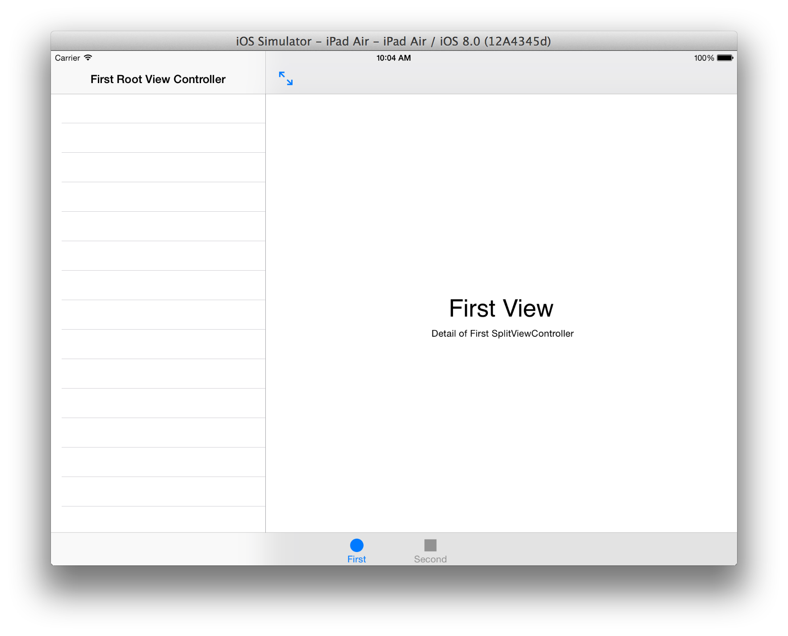
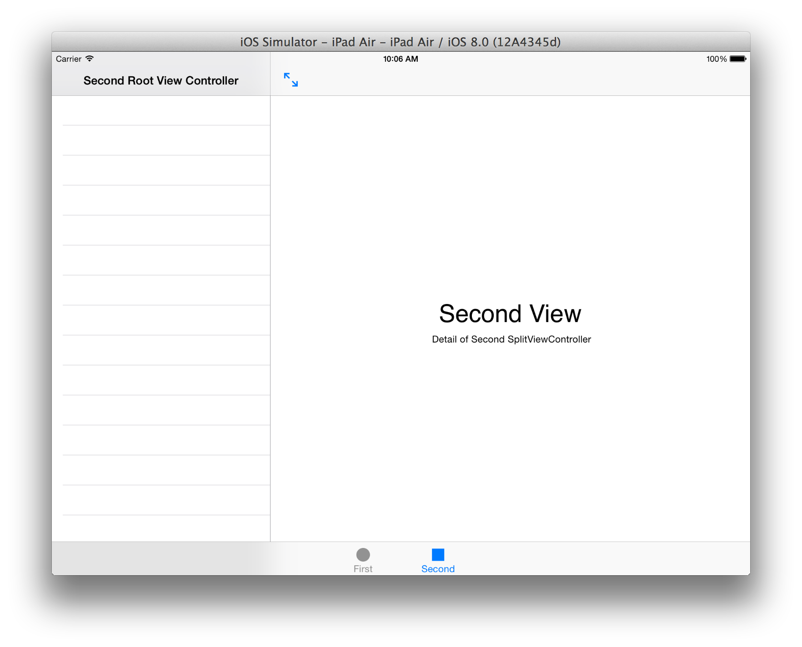
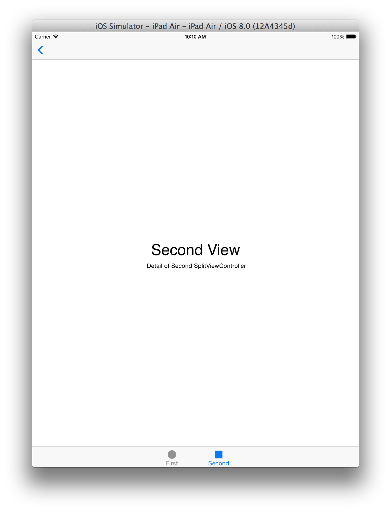
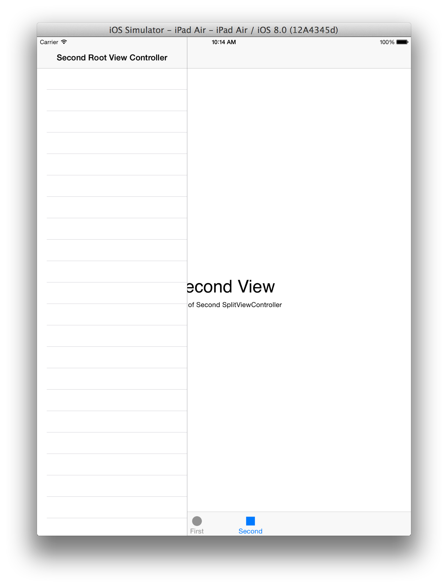
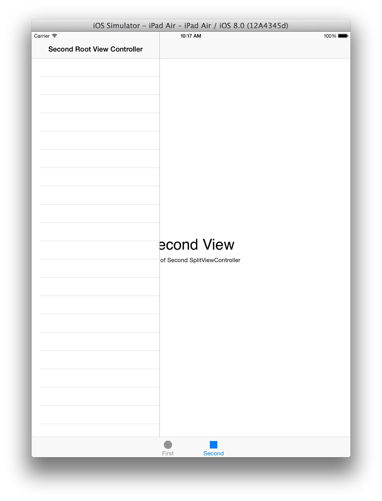
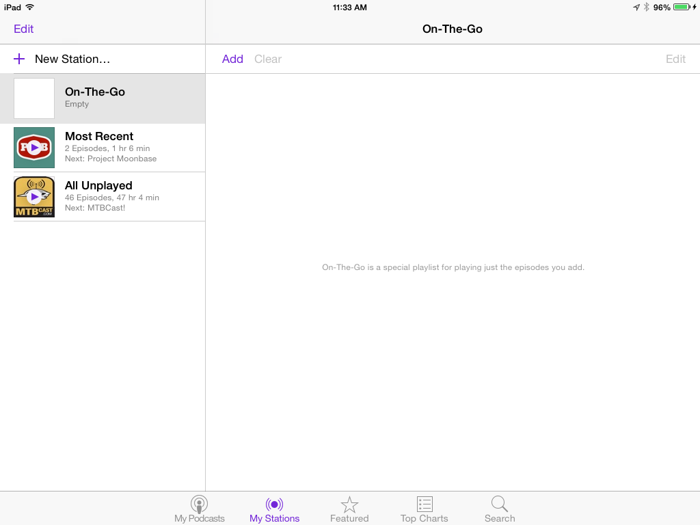
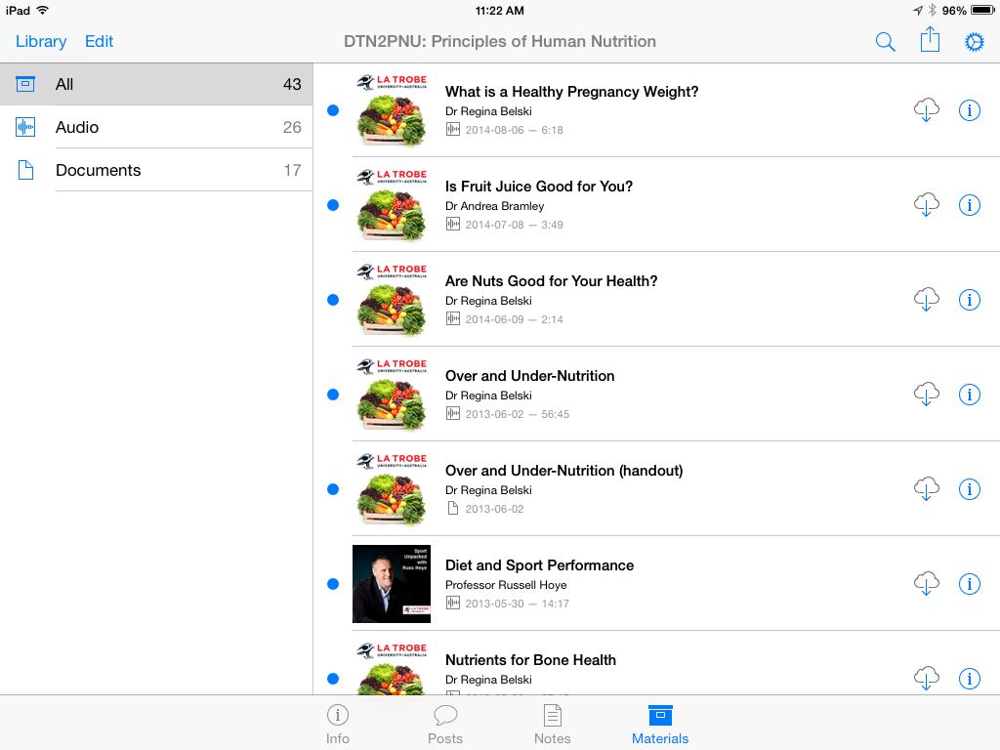
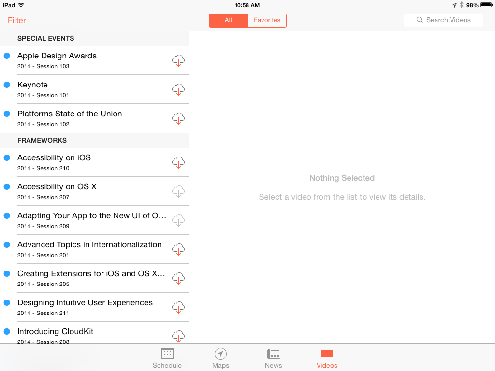

TabsAndSplits
=============

A demonstration of two UISplitViewControllers as children of a UITabBarController

On the iPad simulator in landscape, the two tabs provide the following arrangement of views (as expected). 



Note: The double-arrow button in the top left corner of the detail view is the `UISplitViewController` `-displayModeButtonItem`.

In landscape the `UISplitViewController`'s `preferredDisplayMode` property is set to 

```
self.preferredDisplayMode = UISplitViewControllerDisplayModeAllVisible;
```

Using `- (void)viewWillTransitionToSize:(CGSize)size withTransitionCoordinator:(id<UIViewControllerTransitionCoordinator>)coordinator ` we are watching to see when we switch from landscape to portrait. When detected we change the `UISplitViewController`'s `preferredDisplayMode` property to

```
self.preferredDisplayMode = UISplitViewControllerDisplayModePrimaryHidden;
```

This results in the following arrangement of views (as expected).



Note: The back (<) button in the top left corner of the detail view is the `UISplitViewController` `-displayModeButtonItem`. Tapping this button will, using animation, change the `UISplitViewController`'s `preferredDisplayMode` property to `UISplitViewControllerDisplayModePrimaryOverlay`.

Using this sample app in portrait mode, it is desirable that on tapping the back (<) button in the top left corner in the detail view that the master view should be displayed as an overlay. However, the overlay appears "above" the `UITabBar` as seen below:



There does not appear to be a way to display the overlay in such a fashion as it is *under* the tab bar, but an overlay of the detail view. The appearance of the master view *over top of the tab bar* seems like a violation of the implied view hierarchy.

It was expected, given the arrangement of a UISplitViewController inside a UITabBarController, that the overlay master view controller would be displayed under the tab bar but over the detail view, as see in the following **mockup**:



It should be noted that the iOS 7 documentation specifically states that 

> A split view controller must always be the root of any interface you create. In other words, you must always install the view from a UISplitViewController object as the root view of your application’s window. The panes of your split view interface may then contain navigation controllers, tab bar controllers, or any other type of view controller you need to implement your interface.

https://developer.apple.com/library/ios/documentation/WindowsViews/Conceptual/ViewControllerCatalog/Chapters/SplitViewControllers.html

Despite this statement, however, it appears that several of Apple's own iPad apps are breaking the recommended convention. (The `UISplitViewControllerDisplayModePrimaryOverlay` option is only available in iOS8.)

## Podcasts



## iTunes U



## WWDC


